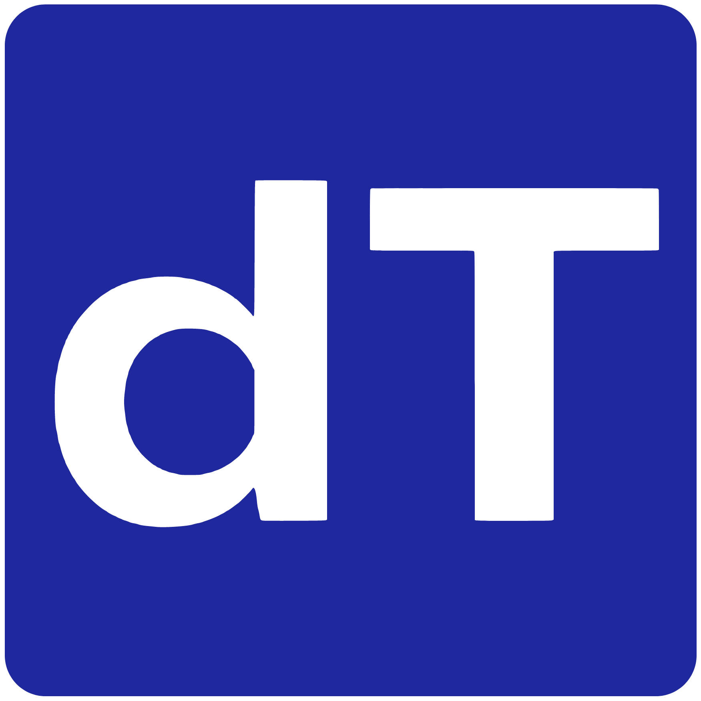

## DecenTRUST 

A hiring platform powered by **Web3**. <br>

 <br>

DecenTRUST enables companies to find *verified talent* through **merit-based** assessment and rewards applicants with **on-chain** proof, ensuring transparency and fairness for both parties.

![Next.js][Next.js] ![Solidity][Solidity] ![Hardhat][Hardhat]

- **Best Consumer Application** \@ [*Sign Protocol*](https://sign.global/)
- **Pool Prize** \@ [*Worldcoin*](https://worldcoin.org/)

Built at [**ETHGlobal Singapore**](https://ethglobal.com/events/singapore2024)

*Now live on DevNet* 🌐 <br>
[decentrust.eth](https://test-eta-ten-26.vercel.app/)

*Check it out from ETHGlobal!* <br>
[ethglobal.com/showcase](https://ethglobal.com/showcase/decentrust-vwp81)

### On-chain Deployments (Testnet)
```
Gnosis (Chiado)
	CA.: 0xdD88CF46B46757651E432F877329ddF63B6640d7
	BE.: https://gnosis-chiado.blockscout.com/address/0xdD88CF46B46757651E432F877329ddF63B6640d7

Linea
	CA.: 0xdD88CF46B46757651E432F877329ddF63B6640d7
	BE.: https://sepolia.lineascan.build/address/0x958A42bd7Da1339D735f9dE8636eFBA9c9635eD6
```
*`CA. = Contract Address`* <br>
*`BE. = Block Explorer`*

### Contributors

- [optimus789](https://github.com/optimus789)
- [r-bytes](https://github.com/r-bytes)
- [munirahzahari](https://github.com/munirahzahari)
- [eesuhn](https://github.com/eesuhn)

<!-- LINKS -->

[Next.js]: https://img.shields.io/badge/next.js-000000?style=for-the-badge&logo=nextdotjs&logoColor=white
[Solidity]: https://img.shields.io/badge/solidity-363636?style=for-the-badge&logo=solidity&logoColor=white
[Hardhat]: https://img.shields.io/badge/hardhat-2F80ED?style=for-the-badge&logo=hardhat&logoColor=white
